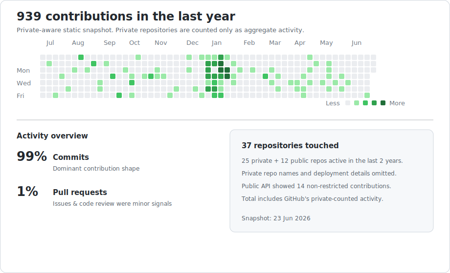

<!-- Public GitHub profile README. Keep client names, private repo names, and deployment details out. -->

# Mark S

### Practical systems builder · Perth, Australia 🇦🇺

Former integrator, now a hands-on developer who turns messy real-world workflows into
working web tools, automations, self-hosted systems, and useful recovery paths — from
drone/geospatial data portals and digital signage to small-business sites and IT recovery.

**Jump to:**
[Work](#-what-i-work-on) ·
[Toolbox](#-toolbox) ·
[Highlights](#-recent-public-highlights) ·
[How I build](#-how-i-tend-to-build) ·
[Activity](#-github-activity-snapshot) ·
[Focus](#-current-focus)

---

## 🛠 What I Work On

| Domain | Focus |
| --- | --- |
| 🤖 **Self-hosted AI** | Agent tooling, memory, search, observability, local-first model workflows. |
| 🛰 **Geospatial / 3D** | Drone & LiDAR data portals, photogrammetry, 3D Tiles, WebGL viewers, aerial mapping & inspection workflows. |
| 📺 **Media & signage** | Digital signage platforms, playback control, browser extensions, media scheduling. |
| 📊 **Business ops** | Dashboards, sign-in flows, reporting, scheduling, and marketing/lead-gen sites for trade & service businesses. |
| 🐳 **Infrastructure** | Linux, Docker, Cloudflare, Nextcloud, GitHub Actions, WordPress, self-hosted systems. |
| 🧹 **Handoffs & recovery** | Codebase cleanup, release packaging, data recovery, public-safe docs from private work. |

## 🧰 Toolbox

**Languages**

**Frameworks & runtimes**

**Infra & platforms**

## ⭐ Recent Public Highlights

> Most recent work is private, so it's summarized by **capability** rather than client, site, or deployment detail.
> These public repos show the *shape* of the work without exposing private use cases.

| Repo | What it shows |
| --- | --- |
| 🤖 [odysseus-hmm](https://github.com/msegec/odysseus-hmm) | Self-hosted AI workspace: agents, memory, local-first UX, telemetry, model tooling. |
| 🌍 [threedtilesviewer](https://github.com/msegec/threedtilesviewer) | Nextcloud/WebGL 3D Tiles viewer — file permissions, mobile support, geospatial rendering. |
| 📺 [pisignage-server-pc-fedition](https://github.com/msegec/pisignage-server-pc-fedition) | Digital signage server/player management and media workflow adaptation. |
| 🎬 [CableTVSimulator](https://github.com/msegec/CableTVSimulator) | Python media scheduling, playback simulation, catalog building, control interfaces. |
| 🖥 [MeshCentral-ENHANCE-](https://github.com/msegec/MeshCentral-ENHANCE-) | Remote operations/RMM exploration, web UI work, operational tooling. |
| 💡 [info-orbs-bretttechoriginal](https://github.com/msegec/info-orbs-bretttechoriginal) | ESP32 display experiments and small hardware UI customization. |
| 🎮 [C&C code/modding forks](https://github.com/msegec?tab=repositories&q=CnC&type=&language=&sort=) | C++, HLSL, and legacy game/modding code exploration. |

## 🧭 How I Tend To Build

- 🎯 Start from the real workflow, not the perfect architecture diagram.
- 🍰 Ship small, working slices and keep durable notes for the next pass.
- 🏠 Prefer self-hosted, owner-controlled systems where that matches the job.
- 🔒 Keep public writeups useful while removing private names, paths, tokens, hosts, and deployment specifics.
- 📦 Treat tests, logs, screenshots, and generated artifacts as part of the handoff, not an afterthought.

## 📈 GitHub Activity Snapshot

> A **static, private-aware** snapshot — not a live third-party stats widget.
> It counts private work only as aggregate activity and omits private repo names, clients, hosts, and deployment paths.

## 🚀 Current Focus

Building cleaner public surfaces around private, practical work: self-hosted AI tooling,
geospatial viewers, operational dashboards, release-ready web apps, and a fuller CV at **[mzs.au](https://mzs.au)**.

---

Most active work lives in private repos. The public surface above is the deliberately-shareable slice — names, hosts, and deployment specifics stay out by design.

