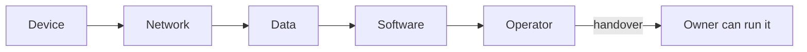

<!-- Public GitHub profile README. Keep client and employer names, private repositories, hosts, incidents, screenshots, unreleased ideas and identifying deployment details out. -->

<picture>
  <source media="(max-width: 600px)" srcset="assets/profile-hero-mobile.svg">
  
</picture>

<div align="center">

# Mark S

**The handyman of digital integrations.**  
15+ years helping people feel confident with their technology.

[](https://mzs.au) [](#fifteen-years-compressed) [](#project-work-redacted)

[](https://mzs.au/portfolio) [](https://mzs.au/resume)

`work` [history](#fifteen-years-compressed) · `projects` [catalogue](#project-work-redacted) · `public` [code](#public-code) · `live` [activity](#recent-github-activity)

</div>

```console
mzs@perth:~$ whoami
mark · practical systems · hardware, field kits and software
mzs@perth:~$ trace --from device --through network,data,software --to operator
ok · owner can run it · receipts live in the handover
```

> [!TIP]
> **Operating principle.** Follow the fault from the device and network through the data, software and operator workflow. *Developer* is a convenient label. It only covers part of the bench.


```mermaid
flowchart LR
  device[Device] --> network[Network] --> data[Data] --> software[Software] --> operator[Operator]
  operator -->|handover| owner[Owner can run it]
```

---

## Fifteen years, compressed

<picture>
  <source media="(max-width: 600px)" srcset="assets/career-arc-mobile.svg">
  
</picture>

I started with computers, circuit boards and networks, then followed the problems through field equipment, UAV operations, mapping, web applications, infrastructure and release engineering.

| Repair | Integrate | Operate | Build |
| :---: | :---: | :---: | :---: |
| devices / data | systems / people | field / spatial | software / ownership |

> [!IMPORTANT]
> **How the work actually happens**
> 1. Start with the real workflow.
> 2. Ship a small working slice, then improve it.
> 3. Prefer systems the owner can control and understand.
> 4. Treat tests, logs, screenshots and release files as part of the handover.
> 5. Keep private names, hosts and deployment details private.

---

## Project work, redacted

Related work is grouped. Client identities, private architecture and unreleased differentiators are omitted.

| Chapter | What sits on that bench |
| :--- | :--- |
| **Systems, hardware and recovery** | `01` networks · `02` electronics · `03` unattended devices · `04` offline search |
| **Operational software** | `05` workflow platforms · `06` dashboards · `07` distributed content · `08` mail automation |
| **Field, spatial and physical** | `09` UAV operations · `10` mapping · `11` browser spatial · `12` sensor prototypes |
| **Platforms and developer tooling** | `13` self-hosted fleets · `14` packaging and releases · `15` local AI · `16` simulation |

<details open>
<summary><strong>I. Systems, hardware and recovery</strong></summary>

**01 / managed networks and recovery**  
<sub>Networks / servers / communications / data</sub>

Designed and supported workstations, servers, wireless networks, communications, security and remote access. Recovered machines and data after hardware faults, damaged installs and incomplete migrations, then documented the result.

**02 / electronic systems lifecycle**  
<sub>Diagnostics / commissioning / maintenance / quality</sub>

Assembled, commissioned and maintained specialist electronics. Work included component diagnosis, preventative maintenance, part sourcing, fabrication and technical records. Repairs were assessed against downtime, parts availability and whether the result could be tested safely. I also handled proof-of-concept testing, quality checks, certification support and regulatory documentation.

**03 / unattended devices**  
<sub>ARM Linux / media / displays / system services</sub>

Built and recovered small devices expected to run unattended. Traced boot, display, audio, playback, storage, network and memory as one chain, covering cold starts, resource use and recovery after interruption.

**04 / offline data recovery and search**  
<sub>Offline indexing / search / local data</sub>

Built local tools to index and search large recovered communication and document archives. Mixed formats were normalised into an offline view while the private source data stayed on the owner's machine.

</details>

<details>
<summary><strong>II. Operational software</strong></summary>

**05 / business workflow platforms**  
<sub>Web applications / databases / permissions / reporting</sub>

Built operational systems around contacts, jobs, inventory, time, scheduling, reporting and staff workflows. Work covered database design, validation, permissions, imports, exports and backup, shaped around the process already in use.

**06 / technical results and dashboards**  
<sub>TypeScript / desktop web technology / charts / filtering</sub>

Parsed XML and CSV exports into searchable desktop reports with charts, filters and preserved source records for later verification.

**07 / distributed content and devices**  
<sub>Device management / scheduled content / offline operation</sub>

Built management software and device integration for distributed displays, covering scheduled content, offline operation, compatibility and recovery.

**08 / mail and messaging automation**  
<sub>Mail monitoring / rules / recoverable automation</sub>

Built mail-monitoring and workflow automation around rule-based handling, important message delivery and recoverable actions.

</details>

<details>
<summary><strong>III. Field, spatial and physical systems</strong></summary>

**09 / UAV operations and field trials**  
<sub>Flight systems / payloads / planning / training</sub>

Planned and delivered UAV work across equipment preparation, field execution, pilot coordination, maintenance and training. Trials combined hardware, sensors, radio links and operating procedures, followed by data checking and handover.

**10 / mapping and measurement workflows**  
<sub>Photogrammetry / GIS / positioning / spatial processing</sub>

Built workflows for image-based mapping, three-dimensional reconstruction, volumetric analysis, coordinate conversion, control points and field positioning. Utilities prepared and validated spatial data before it reached viewers or reports.

**11 / browser-based spatial delivery**  
<sub>TypeScript / WebGL / 3D Tiles / spatial databases</sub>

Developed browser tools for organising, viewing and sharing large spatial datasets. Work covered tiled 3D models, terrain, imagery, permissions, coordinates and self-hosted storage, without requiring specialist desktop software.

**12 / sensor and physical prototypes**  
<sub>Control electronics / sensing / fabrication / testing</sub>

Built electromechanical and sensor prototypes from sketch through controlled testing. Projects combined electronics, sensing, mechanical integration and fabricated parts to test feasibility.

</details>

<details>
<summary><strong>IV. Platforms and developer tooling</strong></summary>

**13 / self-hosted infrastructure and fleets**  
<sub>Linux / containers / virtualisation / backup / remote operations</sub>

Created preflight, deployment, health, upgrade, backup and restore tooling for Linux services and small-machine fleets.

**14 / packaging, releases and endpoints**  
<sub>Desktop applications / CI / signing / updates / rollback</sub>

Built repeatable paths for checking, packaging and distributing software across operating systems. Work included patch maintenance, endpoint setup, release artefacts, checksums, updater metadata and verification of the installed application.

**15 / local AI and agent workflows**  
<sub>Self-hosted AI / coding tools / controlled automation</sub>

Built self-hosted AI workspaces and coding-agent tooling around local and hosted models. The surrounding work concentrated on reliable operation, controlled changes and records of what ran and passed.

**16 / simulation and configuration tools**  
<sub>Simulation / configuration validation / repeatable tests</sub>

Built simulators and configuration tools for device states, validation, preview, backup and repeatable workflow tests without requiring target hardware for every run.

</details>

---

## Public code

The useful public pieces I can show. Where a project builds on someone else's work, I say so.

<table>
<tr>
<td valign="top" width="50%">

### [T3 Code](https://github.com/msegec/t3code_rookie)

<sub>Active fork · interface · server · tests · desktop releases</sub>

Tracks a fast-moving upstream desktop app while keeping the features I use. The [release workflow](https://github.com/msegec/t3code_rookie/blob/main/.github/workflows/mzs-fleet-build.yml) restacks the changes, runs the checks, then publishes checksum-backed Linux and macOS builds with updater metadata.

Public product proposals include [project accents](https://github.com/pingdotgg/t3code/pull/7972), [file uploads](https://github.com/pingdotgg/t3code/pull/8151) and [repository discovery](https://github.com/pingdotgg/t3code/pull/8329).

</td>
<td valign="top" width="50%">

### [MeshAgent proposal](https://github.com/Ylianst/MeshAgent/pull/390)

<sub>Linux session fix · reproduced failure · upstream patch</sub>

A small upstream proposal after reproducing a remote desktop failure caused by multiple active `logind` sessions. The patch selects the real graphical session instead of the display-less user manager.

</td>
</tr>
<tr>
<td valign="top" width="50%">

### [Odysseus experiment](https://github.com/msegec/odysseus-hmm)

<sub>Observe-only telemetry · provenance · tests</sub>

Passive observability and tests added to an existing self-hosted workspace. The work adds traffic classifiers, provenance logging, admin endpoints and standard-library tests without turning the safety layer into a blocker.

</td>
<td valign="top" width="50%">

### [3D Tiles viewer](https://github.com/msegec/threedtilesviewer)

<sub>Original prototype · Nextcloud · WebGL · 3D Tiles</sub>

An original browser-based spatial-data prototype joining file access with 3D Tiles rendering, mobile layouts, coordinate handling and compressed geometry.

</td>
</tr>
</table>

---

## Toolbox

<div align="center">

<picture>
  <source media="(prefers-color-scheme: dark)" srcset="https://skillicons.dev/icons?i=ts%2Cjs%2Cpython%2Cphp%2Cgo%2Cswift%2Ckotlin%2Cc%2Ccpp%2Cnodejs%2Castro%2Clinux%2Cdocker%2Ccloudflare%2Cgithubactions%2Craspberrypi%2Cwordpress&amp;theme=dark">
  
</picture>

<br>

        

     

      

</div>

---

## Recent GitHub activity

<!-- Refresh this block and both SVGs with python3 scripts/update-github-activity.py. -->
<!-- activity:start -->

<table>
  <tr>
    <td align="center"><strong>2,900</strong><br><sub>contributions</sub></td>
    <td align="center"><strong>107</strong><br><sub>active days</sub></td>
    <td align="center"><strong>41</strong><br><sub>day streak</sub></td>
    <td align="center"><strong>2,872</strong><br><sub>private, counts only</sub></td>
  </tr>
  <tr>
    <td align="center" colspan="2"><strong>9</strong><br><sub>public commits</sub></td>
    <td align="center" colspan="2"><strong>8</strong><br><sub>public pull requests</sub></td>
  </tr>
</table>

<picture>
  <source media="(max-width: 600px)" srcset="assets/github-activity-mobile.svg">
  
</picture>

<sub>GitHub API snapshot: 4 September 2026 at 13:52 AWST. Private repository, client, host and deployment details are omitted.</sub>
<!-- activity:end -->

<div align="center">

<sub><kbd>31.95 S</kbd> · <kbd>115.86 E</kbd> · Perth / Western Australia</sub>

<sub>Private names stay private. The useful path stays public.</sub>

</div>
