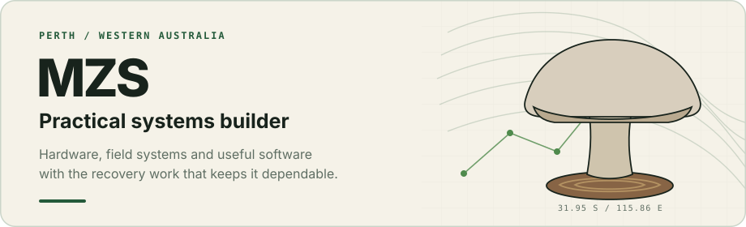
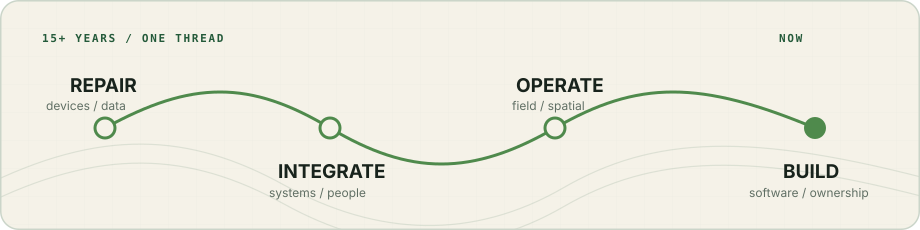
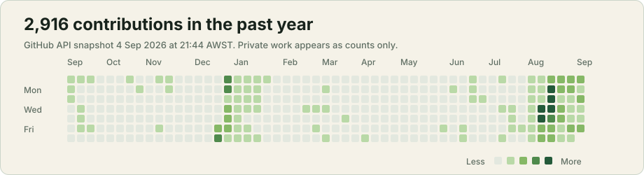

<!-- Public GitHub profile README. Keep client and employer names, private repositories, hosts, incidents, screenshots, unreleased ideas and identifying deployment details out. -->

<picture>
  <source media="(max-width: 600px)" srcset="assets/profile-hero-mobile.svg">
  
</picture>

# Mark S

**The handyman of digital integrations.**  
15+ years helping people feel confident with their technology.

[Portfolio](https://mzs.au/portfolio) · [Resume](https://mzs.au/resume)

[Experience](#how-the-work-developed) · [Project work](#project-work-redacted) · [Public code](#public-code) · [Activity](#recent-github-activity)

> I work across devices, networks, data and software, then document enough for the owner to run and recover the result. Developer is a convenient label. It only covers part of the bench.

## How the work developed

<picture>
  <source media="(max-width: 600px)" srcset="assets/career-arc-mobile.svg">
  
</picture>

**Repair.** I began with computers, circuit boards and networks: finding component faults, recovering data, replacing what had failed and explaining the repair in plain language.

**Integrate.** The work widened into servers, wireless links, communications, security, remote access and multi-site support. That included migrations, hosted-service rollouts, demonstrations and on-site onboarding, with the handover treated as part of the job.

**Operate.** Specialist electronics led into commissioning, product evaluation, quality and compliance records, UAV operations, mapping and field trials. I prepared equipment, coordinated pilots, maintained aircraft, trained operators and turned field data into something another person could use.

**Build.** Repeated operational problems became software, automation and self-hosted services. I now work across the whole path from physical device and source data to application, release and recovery, choosing the simplest useful boundary for each job.

## Project work, redacted

These are recurring areas of work, not a product catalogue. One project often crosses several sections. Client identities, private architecture and unreleased differentiators are omitted.

<strong>I. Systems, hardware and recovery</strong>

### 01 / managed networks and migrations

Networks / servers / communications / remote access

Designed and supported workstations, servers, wireless networks, communications, security controls and remote access. The same work included platform migrations, multi-site support, backup review, service recovery and practical documentation for the people taking ownership.

### 02 / electronics repair, commissioning and maintenance

Diagnostics / fabrication / quality / compliance

Assembled and maintained specialist electronics, diagnosed component faults, sourced parts and fabricated replacements. I also ran product tests and prepared quality, certification and regulatory records. Repair decisions accounted for downtime, parts availability and whether the result could be verified safely.

### 03 / unattended devices

Small computers / media / storage / system services

Built and recovered small Linux devices expected to run without supervision. Startup, media, storage, connectivity and resource use were treated as one system, including recovery after interruption and proof that a cold start reached the intended operating state.

### 04 / local-first indexing and search

Mixed-format data / offline indexing / private source material

Built local tools that turn large mixed-format archives into a consistent, searchable view. Normalisation and indexing happen without moving the private source material away from the owner's machine.

<strong>II. Operational software</strong>

### 05 / business administration software

Web applications / databases / permissions / reporting

Built systems around contacts, jobs, inventory and reporting, shaped around the process already in use. Delivery covered data design, validation, permissions, imports, exports and clear operating instructions rather than forcing the work into a generic package.

### 06 / technical report viewers

Structured exports / charts / filtering / desktop delivery

Turned XML and CSV exports into searchable desktop reports with charts and filters. The emphasis was on making technical results easier to inspect while keeping a direct route back to the supplied records.

### 07 / remote content and device management

Distributed devices / scheduled content / operational support

Built management software and device integration for groups of remote displays. The work joined content preparation, schedules, device state and operator controls into one manageable workflow, with enough status information to support the devices from elsewhere.

<strong>III. Field, spatial and physical systems</strong>

### 08 / UAV operations and field trials

Flight systems / payloads / planning / training

Prepared equipment, coordinated pilots, ran field work, maintained aircraft and trained operators. Product evaluations and proof-of-concept trials brought hardware, sensors and operating procedures together before a documented handover.

### 09 / mapping and measurement workflows

Photogrammetry / GIS / positioning / spatial processing

Built workflows for image-based mapping, three-dimensional reconstruction, volumetric analysis, coordinate conversion, control points and field positioning. Utilities prepared shapefiles and other spatial data, checked inputs and reduced avoidable errors before the results reached viewers or reports.

### 10 / spatial data in the browser

TypeScript / WebGL / 3D Tiles / spatial databases

Developed browser tools for organising and viewing large spatial datasets. The work covered rendering, access control, coordinate handling and layouts that remained practical away from a specialist desktop workstation.

### 11 / electronics and sensor prototypes

Control electronics / sensing / fabrication / testing

Built and tested prototypes combining electronics, sensors, mechanical parts and custom fabrication. The point was to answer a concrete feasibility question, measure the result and expose weak assumptions before committing to a larger build.

<strong>IV. Platforms and developer tooling</strong>

### 12 / infrastructure and small-device fleets

Linux / containers / virtualisation / remote operations

Created operational tooling for Linux services, self-hosted infrastructure and groups of small devices. It covers readiness, maintenance, health and recovery while keeping routine checks repeatable and failures visible.

### 13 / desktop packaging and updates

Cross-platform applications / CI / releases / verification

Built repeatable checking, packaging and release paths for desktop software across operating systems. That includes maintaining patches, producing release artefacts and proving the installed application, not merely the build job that created it.

### 14 / controlled AI and developer automation

Local tools / coding agents / reviewed changes / evidence

Worked on locally controlled AI tools and coding-agent workflows, with emphasis on reliable operation, reviewed changes and verifiable results. Automation is useful when its authority is clear and its output can still be inspected by a person.

### 15 / simulation, testing and configuration

Device workflows / validation / repeatable tests

Built simulation and configuration tools used to test device workflows without requiring target hardware for every run. These tools make state changes visible, catch invalid inputs early and turn repeated manual checks into reproducible tests.

## Public code

Most of the work above is private. These are smaller public pieces that show how I approach maintenance, fault isolation and original builds. Where something extends another project, it is labelled as a fork, proposal or experiment.

### [T3&nbsp;Code](https://github.com/msegec/t3code_rookie)

Active fork / interface / server / tests / desktop releases

Maintains a focused feature layer over a fast-moving upstream application. Its release path restacks that work, runs the required checks and publishes checksum-backed desktop builds with updater metadata. Public upstream proposals cover interface and repository workflow improvements.

### [MeshAgent proposal](https://github.com/Ylianst/MeshAgent/pull/390)

Linux session handling / reproduced failure / upstream patch

A small Linux session-handling fix developed from a reproduced remote desktop failure, then submitted to the project that owns the behaviour.

### [Odysseus experiment](https://github.com/msegec/odysseus-hmm)

Fork / observe-only telemetry / provenance / tests

A fork of [arcahyadi/odysseus](https://github.com/arcahyadi/odysseus) with a focused observe-only telemetry experiment. The added checks record useful evidence without turning the safety layer into a blocker.

### [3D tiles viewer](https://github.com/msegec/threedtilesviewer)

Original early-stage experiment / Nextcloud / browser spatial data

An original early-stage Nextcloud and 3D Tiles experiment. The repository captures the intended file-access and browser-viewing direction, but remains a work in progress.

## Toolbox

**Applications:** `TypeScript` `JavaScript` `Python` `PHP` `Go` `Swift` `Kotlin` `C` `C++` `Node.js` `SolidJS` `React` `Astro` `Electron`

**Spatial and data:** `Three.js` `WebGL` `3D Tiles` `GIS` `PostgreSQL` `PostGIS` `SQLite` `XML` `CSV`

**Systems:** `Linux` `Windows Server` `Docker` `Cloudflare` `GitHub Actions` `networking` `firewalls` `VPN` `Raspberry Pi` `Orange Pi`

**Physical work:** `electronics` `embedded systems` `UAV systems` `photogrammetry` `3D printing` `fabrication` `QA` `compliance records`

## Recent GitHub activity

<!-- Refresh this block and both SVGs with python3 scripts/update-github-activity.py. -->
<!-- activity:start -->

**2,916 contributions** across **107 active days**, with a current streak of **41 days**. GitHub counted **13 public commit contributions** and **9 public pull requests**. Private work appears only as an aggregate count of **2,883 contributions**.

<picture>
  <source media="(max-width: 600px)" srcset="assets/github-activity-mobile.svg">
  
</picture>

GitHub API snapshot: 4 September 2026 at 21:44 AWST. Private repository, client, host and deployment details are omitted.
<!-- activity:end -->

Perth / Western Australia · Private names and deployment details remain private.

